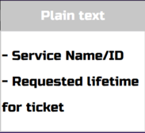

# Kerberos Authentication

## Introduction:

Hi, in this article, I invite you to embark on a captivating journey through the realm of Kerberos, as I share my research insights gained as an offensive security student. Together, we will unravel the inner workings of this powerful authentication system, demystifying its concepts and exploring its practical applications.

So, let's embark on this enlightening exploration of Kerberos together. Brace yourself for an immersive learning experience, as we unlock the secrets of secure authentication and pave the way for a more secure digital world. Let's go!!

## What is Kerberos?

Kerberos, the meticulous three-headed guardian dog, diligently protects the underworld from invaders and imposters, fulfilling his duty with unwavering dedication🦴🦴🦴.

<figure><figcaption></figcaption></figure>

From a technical standpoint, Kerberos is an advanced network authentication protocol designed to ensure secure identity verification within a networked environment. Its operation revolves around a trusted third-party server known as the Key Distribution Center (KDC), which can be envisioned as a ticket seller that issue encrypted tickets.

## TGT vs Service Ticket vs Authenticators

> Don't know what this is, just don't worry, we will discuss them all.

To gain passage into the underworld, you must overcome the formidable Kerberos. But here's the twist: each of the three heads of this legendary dog guards a ticket that must be passed along in sequence. The first ticket you come across is known as the TGT (Ticket Granting Ticket): Ticket Granting Ticket (TGT):

#### 1. Ticket Granting Ticket (TGT):

A TGT is a ticket issued by the Key Distribution Center (KDC) to a user during the initial authentication process. It serves as a proof of identity for the user and is used to request service tickets. The TGT is encrypted using the user's secret key and is obtained by the user after successful authentication with the KDC.

#### 2. Service Ticket:

A Service Ticket is a credential issued by the TGS in response to a user's request for access to a specific service. The user presents the TGT to the TGS along with a request for a Service Ticket. The TGS validates the TGT and generates a Service Ticket for the requested service. The Service Ticket contains information such as the user's principal name, a session key, and an expiration time it is encrypted with the KDC secret key. The user presents the Service Ticket to the desired service to authenticate and gain access.

#### 3. Authenticators:

An authenticator is a message sent by a client to a specific service in order to prove the client's identity. It contains encrypted information, such as a timestamp, that ensures the freshness and integrity of the request. Authenticators are used in the process of requesting access to services and are presented along with service tickets.

These components work together in the Kerberos authentication process to establish secure connections and verify identities in a networked environment.

## How does the KDC grant Service Ticket?

First of all, what does the User and KDC must have pre-authentication to it be successful.

### For the User:

#### 1. User Principal Name (UPN):

The user must have a principal name, which uniquely identifies them within the Kerberos realm. The principal name typically follows the format of "user@realm", where "user" is the user's username and "realm" is the name of the Kerberos realm.

#### 2. Password:

Derived from the password , we get our long-term user secret key by hasing mechanism that will be securely stored and used for encryption and decryption operations during the authentication process.

### For the KDC:

#### 1. Database of Principals:

The KDC must maintain a database of principals, which includes information about the users and services within the Kerberos realm. This database typically stores the principal names, their associated long-term secret keys, and other relevant information.

#### 2. KDC Secret Key:

The KDC has its own long-term secret key, known only to the KDC itself. This key is used for encrypting and decrypting of the TGTs.

## In simple terms:

The Key Distribution Center (KDC) consists of two components: The Authentication Server (AS) and the Ticket Granting Server (TGS).

First thing the user sends his username to the AS provides the Ticket Granting Ticket (TGT) to the users.

When a user wants to access a specific service, they present their TGT to the TGS. The TGS verifies the TGT's authenticity and, upon successful validation, issues a service ticket. The service ticket grants the user access to the requested service and is encrypted with the service's secret key.

## More Details?

_**Now let's delve into the process of authentication (Get your notebook plus a cup of coffee, and come back, this can be tricky if this is your first time):**_

<figure><figcaption></figcaption></figure>

> _**After every operation done, you will find the messages that it ended up sending to help you keep track with the process. Let's keep going.**_

Let's start from the user sending his credentials.

User side:

* First of all, the user sends a message that present his Principal Name and a Requested lifetime for TGT.

<figure><figcaption></figcaption></figure>

AS side:

* The Authentication Server (AS) gets the User's Principal Name and search for its correspondent long-term secret key in its database.
* The AS creates two messages, the first contains the TGS ID, timestamp, lifetime plus a TGS Session Key (this is a randomly generated synchronous key), it encrypts this message using the long-term secret key of the User.
* The second message consist of the same components as the first one plus the User's IP address, this message is encrypted by KDC's long-term secret key. (This is the TGT)

<figure><figcaption></figcaption></figure>

User side:

* The user gets the two messages, first message is decrypted by user long-term secret key, as we know the user doesn't have it, to get it the user enters his password, the password gets added to a salt and version then hashes it, if the password is correct the hash well decrypt the message else the authentication will fail.

The second message is the TGT.

* Two messages will be added with the TGT, the first is a plain text message contains the Service Name/ID and requested lifetime for service ticket.
* The second message is the user authenticator consist of the Users Principal Name plus a timestamp and it is encrypted with the TGS session key, that it got from the first AS message.

<figure><figcaption></figcaption></figure>

TGS side:

* We got 3 messages here, a plain text and two encrypted ones.
* The TGS decrypt the TGT with KDC's long-term secret key, then he gets the TGS session key.
* Using the TGS session key, it decrypts the other encrypted message and gets the User Principal Name plus the timestamp, compare it to the timestamp from the TGT (it tolerates till 2 min of delay between the two).
* Then the TGS gets the Service Name/ID from the plain text message and search in its database of services for the service long-term secret key. It adds the Service Name/ID to a new message plus a lifetime, timestamp and Service Session Key (this is a randomly generated synchronous key), it encrypts it using TGS session key.
* For the second Message it contains the same as the first message plus User IP address and User Principle Name encrypts it using the service long-term secret key (Service Ticket).

<figure><figcaption></figcaption></figure>

User side:

* Notice that the user already got TGS session key from previous messages.
* The user decrypts the first message using TGS Session Key, and take the Service Session Key.
* It leaves the Service Ticket as it is.
* Adds a message with User Principal Name and timestamp, it encrypts it using Service Session key.

<figure><figcaption></figcaption></figure>

Service Side:

* The service gets the two messages decrypt the first using his long-term secret key, and gets the Service Session Key.
* Decrypts the second message using the Service Session Key.

Now the two messages are decrypted, it compares the timestamps (tolerates 2 min delay) and the User Principal Name, finally it compares the IP address to the IP address that send the message.

## Advantages & Limitations

Kerberos offers several advantages as a network authentication protocol. Here are some of the key advantages of Kerberos:

1. Strong Authentication: Kerberos provides strong mutual authentication between clients and services. It verifies the identities of both parties involved in the authentication process, reducing the risk of impersonation or unauthorized access.
2. Single Sign-On (SSO): Kerberos enables Single Sign-On functionality, allowing users to authenticate once and gain access to multiple services without the need for repeated authentication. Once a user obtains a Ticket Granting Ticket (TGT), they can request Service Tickets for various services without re-entering their credentials.
3. Single Sign-On (SSO): Kerberos enables Single Sign-On functionality, allowing users to authenticate once and gain access to multiple services without the need for repeated authentication. Once a user obtains a Ticket Granting Ticket (TGT), they can request Service Tickets for various services without re-entering their credentials.
4. Strong Security Features: Kerberos incorporates encryption and message integrity checks to protect against eavesdropping, tampering, and replay attacks. It uses secure session keys for encrypted communication.

From a cybersecurity perspective, it is important to consider the limitations of Kerberos. Here are some noteworthy constraints associated with this network authentication protocol:

<figure><figcaption></figcaption></figure>

1. Single Realm Architecture: Kerberos operates within a single realm, which limits its scalability for large distributed environments with multiple independent authentication domains. Establishing trust relationships and cross-realm authentication between different Kerberos realms can be complex.
2. Centralized Key Distribution Center (KDC): The reliance on a centralized KDC introduces a potential single point of failure. If the KDC becomes unavailable or compromised, it can disrupt the entire authentication process.
3. Offline Attacks: Kerberos relies on shared secret keys between the KDC and clients. If an attacker gains access to the KDC's database or captures the communication between a client and the KDC, they can potentially mount offline attacks to crack the encryption keys.
4. Credential Forwarding: Kerberos relies on ticket forwarding, where a compromised client may be able to forward authentication credentials to unauthorized services, potentially leading to privilege escalation or unauthorized access.
5. Credential Forwarding: Kerberos relies on ticket forwarding, where a compromised client may be able to forward authentication credentials to unauthorized services, potentially leading to privilege escalation or unauthorized access.

## Conclusion

In conclusion, Kerberos is a powerful network authentication protocol that ensures secure identity verification. Through the use of encrypted tickets and a trusted Key Distribution Center, Kerberos provides effective access control and protection against unauthorized access. Its role in fortifying network security and enabling reliable authentication is crucial in today's evolving threat landscape.

In the next article, we will delve into the various attacks that can be launched against Kerberos, exploring the vulnerabilities. Stay tuned for an in-depth analysis of Kerberos security challenges and mitigation strategies.
